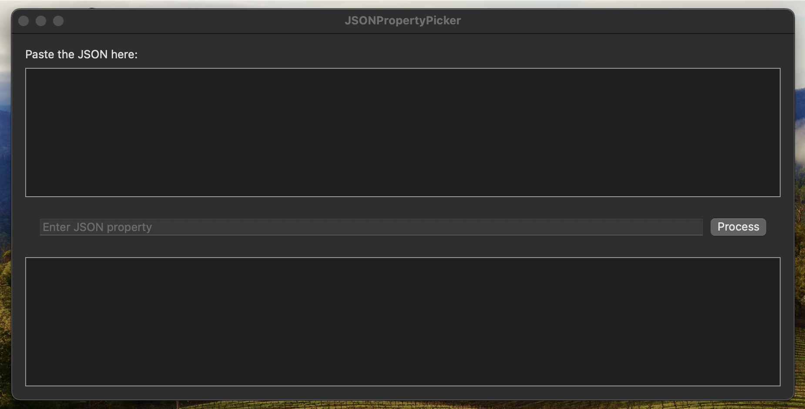
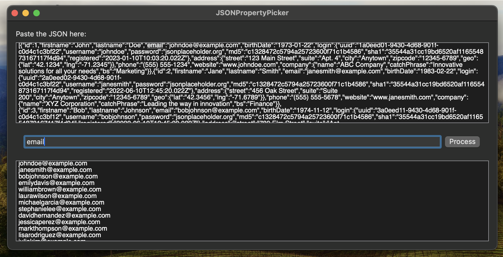

# JSON Property Picker - MacOS 📝🔍

## Description
JSON Property Picker is a SwiftUI-based macos application that allows you to easily extract specific property values from a given JSON input. Whether you're dealing with complex nested JSON structures or simple JSON objects, this tool provides a user-friendly interface to search for and retrieve the desired properties.

## Features
- 🖊️ **Paste JSON**: Input your JSON data directly into the application.
- 🔎 **Property Search**: Enter the JSON property you wish to extract.
- ⚡ **Process JSON**: Click the process button to retrieve the property values.
- 📜 **View Results**: Display the extracted values in a separate text editor.

## Usage
1. **Paste JSON**: Copy and paste your JSON data into the provided text editor.
2. **Enter Property**: Type the name of the property you want to search for in the JSON.
3. **Process**: Click the "Process" button to extract the property values.
4. **View Results**: The extracted values will be displayed in the results text editor.

## Screenshots



## Installation
1. Clone the repository:
   ```bash
   git clone https://github.com/yourusername/JSONPropertyPicker.git
